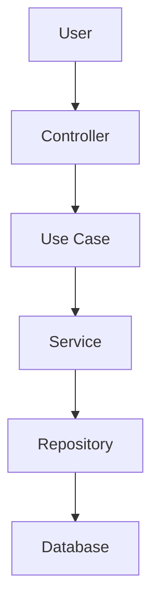

# 📚 Documentação - MultiShop

## 📁 Estrutura da Pasta `docs/`

```
docs/
├── architecture/              # Documentação de arquitetura
│   ├── overview.md            # Visão geral da arquitetura
│   ├── clean-architecture.md  # Clean Architecture detalhado
│   ├── modules.md             # Estrutura de módulos
│   ├── database.md            # Esquema do banco de dados
│   └── diagrams/              # Diagramas (Mermaid, PlantUML)
│       ├── system-overview.md
│       ├── auth-flow.md
│       └── tenant-isolation.md
│
├── api/                       # Documentação de APIs
│   ├── README.md              # Índice de APIs
│   ├── authentication.md      # Endpoints de autenticação
│   ├── tenant.md              # Endpoints de tenant
│   ├── subscription.md        # Endpoints de subscription
│   └── webhooks.md            # Webhooks (Stripe, etc.)
│
├── guides/                    # Guias práticos
│   ├── getting-started.md     # Como começar
│   ├── development.md         # Setup de desenvolvimento
│   ├── testing.md             # Como testar
│   ├── deployment.md          # Como fazer deploy
│   ├── css-guide.md           # Guia de estilos CSS
│   ├── i18n.md                # Internacionalização
│   └── troubleshooting.md     # Resolução de problemas
│
├── features/                  # Documentação de features
│   ├── multi-tenancy.md       # Como funciona multi-tenancy
│   ├── rbac.md                # Role-Based Access Control
│   ├── subscriptions.md       # Sistema de assinaturas
│   ├── payments.md            # Integração com Stripe
│   └── themes.md              # Sistema de temas por tenant
│
├── contributing/              # Guias para contribuidores
│   ├── code-style.md          # Padrões de código
│   ├── git-workflow.md        # Workflow do Git
│   ├── pull-requests.md       # Como fazer PRs
│   └── commit-conventions.md  # Convenções de commit
│
└── adr/                       # Architecture Decision Records
    ├── 001-repository-pattern.md
    ├── 002-clean-architecture.md
    ├── 003-multi-tenant-strategy.md
    └── 004-css-per-tenant.md
```

---

## 📖 Tipos de Documentação

### **1. Architecture** (`docs/architecture/`)

Documentação técnica sobre como o sistema é estruturado.

**Conteúdo:**

- Visão geral da arquitetura (Clean Architecture)
- Estrutura de camadas (Domain, Infrastructure, Application, Presentation)
- Padrões de design utilizados (Repository, Use Case, Factory)
- Esquema do banco de dados (models Prisma)
- Diagramas de fluxo (autenticação, criação de tenant, etc.)

**Público:** Desenvolvedores técnicos, arquitetos

---

### **2. API** (`docs/api/`)

Documentação de todos os endpoints da aplicação.

**Conteúdo:**

- Lista de todos os endpoints
- Métodos HTTP (GET, POST, PUT, DELETE)
- Parâmetros de entrada
- Respostas esperadas
- Códigos de erro
- Exemplos de uso (curl, JavaScript)

**Público:** Desenvolvedores frontend, integradores

**Formato:** Markdown ou OpenAPI/Swagger

---

### **3. Guides** (`docs/guides/`)

Guias práticos passo-a-passo.

**Conteúdo:**

- Como configurar ambiente de desenvolvimento
- Como rodar testes
- Como fazer deploy
- Como customizar CSS de um tenant
- Como adicionar novo idioma (i18n)
- Troubleshooting de problemas comuns

**Público:** Desenvolvedores novos, time de suporte

---

### **4. Features** (`docs/features/`)

Documentação de funcionalidades específicas.

**Conteúdo:**

- Como funciona o multi-tenancy
- Como funciona o RBAC (roles e permissões)
- Como funciona o sistema de assinaturas
- Como funciona a integração com Stripe
- Como funciona o sistema de temas customizados

**Público:** Product Managers, desenvolvedores, clientes enterprise

---

### **5. Contributing** (`docs/contributing/`)

Guias para quem vai contribuir com código.

**Conteúdo:**

- Padrões de código (ESLint, Prettier)
- Workflow do Git (branches, commits, PRs)
- Como fazer Pull Requests
- Convenções de commit (Conventional Commits)
- Code review checklist

**Público:** Contribuidores, time de desenvolvimento

---

### **6. ADR** (`docs/adr/`)

Architecture Decision Records - histórico de decisões arquiteturais.

**Conteúdo:**

- Por que escolhemos Clean Architecture?
- Por que escolhemos Repository Pattern abstrato?
- Por que escolhemos CSS por tenant em vez de Tailwind dinâmico?
- Por que escolhemos cookies para idioma em vez de URL?

**Formato:**

```markdown
# ADR 001: Repository Pattern

## Status

Aceito

## Contexto

Precisávamos de uma forma de abstrair acesso ao banco de dados...

## Decisão

Escolhemos implementar Repository Pattern abstrato...

## Consequências

✅ Vantagens: ...
❌ Desvantagens: ...
```

**Público:** Arquitetos, desenvolvedores sêniors

---

## 🎯 Boas Práticas

### **1. Use Markdown**

- ✅ Fácil de ler
- ✅ Versionável (Git)
- ✅ Renderiza bem no GitHub
- ✅ Suporta código, imagens, tabelas

### **2. Use Diagramas**

````markdown
# Diagrama com Mermaid


````

````

### **3. Exemplos de Código**
Sempre que possível, inclua exemplos práticos:

```typescript
// ✅ BOM: Exemplo prático
const result = await userService.createUser({
  email: 'user@example.com',
  password: 'Password123',
  name: 'John Doe'
})

// ❌ EVITE: Apenas texto sem exemplo
"Para criar um usuário, use o método createUser..."
````

### **4. Mantenha Atualizado**

- 📝 Atualize documentação junto com código
- 🔄 Revise documentação em PRs
- ⚠️ Marque documentação desatualizada

### **5. Links Internos**

```markdown
Veja também:

- [Arquitetura Geral](../architecture/overview.md)
- [API de Autenticação](../api/authentication.md)
- [Guia de Testes](./testing.md)
```

---

## 📋 Checklist de Documentação

Ao implementar uma nova feature:

- [ ] **Architecture**
  - [ ] Atualizar diagrama de sistema
  - [ ] Documentar novos módulos
  - [ ] Atualizar schema do banco

- [ ] **API**
  - [ ] Documentar novos endpoints
  - [ ] Incluir exemplos de request/response
  - [ ] Documentar códigos de erro

- [ ] **Guides**
  - [ ] Atualizar guia de desenvolvimento se necessário
  - [ ] Adicionar troubleshooting se aplicável

- [ ] **Features**
  - [ ] Criar doc da feature (se for nova)
  - [ ] Explicar como usar
  - [ ] Incluir exemplos práticos

- [ ] **ADR** (se decisão arquitetural)
  - [ ] Criar ADR com contexto e decisão
  - [ ] Explicar trade-offs

---

## 🚀 Ferramentas Úteis

### **Geração Automática**

- **TypeDoc** - Gera docs do TypeScript
- **Swagger/OpenAPI** - Documenta APIs automaticamente
- **Docusaurus** - Site de documentação estático

### **Diagramas**

- **Mermaid** - Diagramas em Markdown
- **PlantUML** - Diagramas UML
- **Excalidraw** - Desenhos à mão

### **Hosting**

- **GitHub Pages** - Gratuito
- **Vercel** - Deploy automático
- **ReadTheDocs** - Para projetos open-source

---

## 📝 Template de Documentação

### **Feature Documentation Template**

```markdown
# [Nome da Feature]

## 📋 Visão Geral

Breve descrição do que a feature faz.

## 🎯 Casos de Uso

- Caso de uso 1
- Caso de uso 2
- Caso de uso 3

## 🏗️ Arquitetura

Explicação técnica de como funciona.

## 📝 Como Usar

### Exemplo 1

\`\`\`typescript
// código aqui
\`\`\`

### Exemplo 2

\`\`\`typescript
// código aqui
\`\`\`

## ⚙️ Configuração

Configurações necessárias.

## 🐛 Troubleshooting

Problemas comuns e soluções.

## 🔗 Links Relacionados

- [Link 1](...)
- [Link 2](...)
```

---

## ✅ Estrutura Completa

A pasta `docs/` agora está organizada de forma profissional:

- ✅ **Separação clara** de tipos de documentação
- ✅ **Fácil navegação** com estrutura hierárquica
- ✅ **Escalável** - adicionar novos docs é simples
- ✅ **Versionável** - tudo em Markdown no Git
- ✅ **Buscável** - estrutura lógica

🎉 **Pronta para documentação completa do projeto!**
